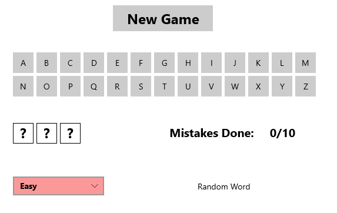

# Hangman Game UWP

Welcome to Hangman UWP, the ultimate word guessing game

The project is based on OOP and contains:
1. Wordbank - Contains the possible words and editable
2. Manager - Handles the logic of the game (it includes choosing the random war, determining if the player has lost/won, etc)
3. UI - Contains the UI elements and some of the relevant code 


## Features
- Intuitive and user-friendly interface
- 2 Difficulty levels
- Different sounds when you win or lose
- Button to start a new game

## How to Play
1. Select a difficulty level
2. Click "New Game"
3. Start guessing the word by suggesting letters
5. Keep track your number of mistakes


```


```
